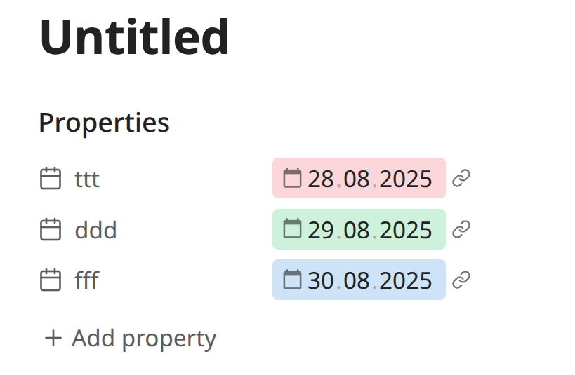
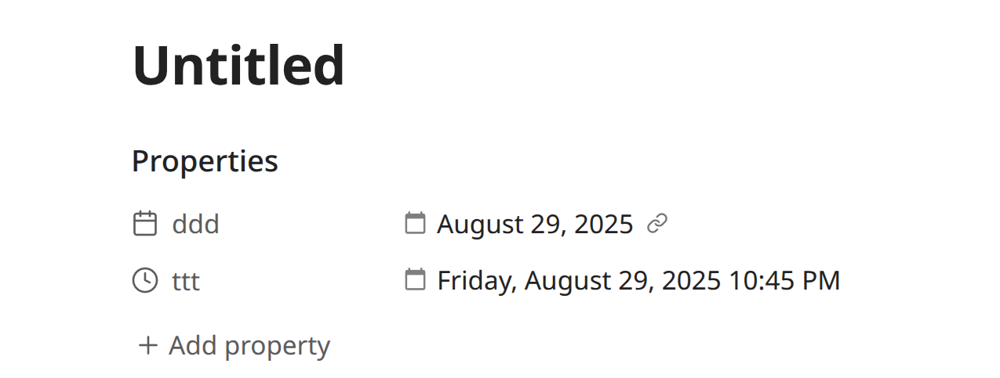
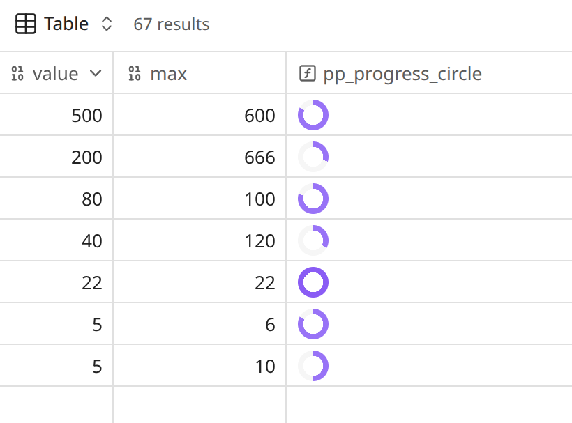

# Pretty properties

This plugin makes metadata block on the top of the file more visually appealing with images and colors.


## Features

### Cover image

Add image to the left of metadata block to save space in the note. Works great for book notes, people profiles etc. You can change the shape and size of the image using cssclasses.

To add image put image link into the "cover" property (must be of type "text"). You can use embeds, wikilinks, markdown links or bare urls for external images.

Add cssclasses to the note to change the shape and the fitting of the image. Currently supported classes:

-   "cover-initial" (default shape)
-   "cover-initial-width-2" (default shape with different width)
-   "cover-initial-width-3" (default shape with another width)
-   "cover-vertical-cover" (vertical image with object-fit "cover")
-   "cover-vertical-contain" (vertical image with object-fit "contain")
-   "cover-vertical" (legacy option, works the same as "cover-vertical-contain")
-   "cover-horizontal-cover" (horizontal image with object-fit "cover")
-   "cover-horizontal-contain" (horizontal image with object-fit "contain")
-   "cover-horizontal" (legacy option, works the same as "cover-horizontal-cover")
-   "cover-square"
-   "cover-circle".

You can right-click on existing cover or call command to open menu to select image or cover shape. You also can set the widths of all possible shapes in the settings.

> [!NOTE]  
> Cover shapes would look a bit different on mobile devices with small screen. This is intentional to make them look more neat in the limited space.


### Banner

You can add simple banners to your notes. To do so add the link to the "banner" property the same way as with cover.


Property "banner_position" allows you to vertically position banner image. To change the position put into this property a number from 0 to 100.

You can right-click on existing banner or call command to open menu to select banner image or change banner position.

### Icon

You can add icons alongside tha banner or just on their own. To do this add a link or some text to the "icon" property. For the icon you can use images, built-in Lucide icons or any symbols, including emoji:

-   add internal or external link to add image;
-   add the name of lucide icon, for example "star", to add svg icon;
-   if you add any other text, the first symbol will be shown as icon.


You can right-click on existing icon or call command to open icon suggestion menu.

### Hide properties

If you have many properties in the note, you may want to hide some of them while keeping the others visible. This plugin makes it easy. Click on the property icon and select "Hide property" in menu. If you want to see it again, run command "Toggle reveal / hide all hidden properties". After that you will see the hidden properties and can mark them as not hidden.


### Colorful list properties

You can make you list properties stand out by assigning each item their own color. Right-click on the item pill to select color. You can also chose "none" to make the pill background transparent or reset it to default. Only basic theme colors are supported for now.


You can also add you own styling to the list properties. Each of them (even not colored ones) will get attribute "data-property-pill-value" containing actual value of item. You can use these attributes to write you own css for any individual item like this:

```
[data-property-pill-value="my-property-value"] {    /* my styles */}
```

### Colorful text properties

You can also add color to the text properties. Hover over property value to reveal the color button. Remember, then the color assigned to the specific text, so if you edit the text the color may disappear. By default color buttons for text properties are disabled in bases, because they can make base loading a bit slower. You can turn it on in the settings.


You can edit both text and list properties colors from the settings tab. There you can select color not only from the theme colors, but also from the color picker.

### Date colors

Every date property gets an attribute "data-relative-date" with the possible values being "past", "present" and "future". It allows to style dates differently based of their relation to the current time. You can add some css yourself or you can select the colors from the pickers in the settings to mark past, present and future dates.



Relative date attributes are not updated automatically as the time pass. If the time have come for the "present" date to be turned into the "past" date, you need to reopen the note to change the color.

### Custom date formats

You can select custom formats for the date and datetime properties. Set format in the settings using the moment.js syntax. 



Keep in mind that the date presentation is changed by adding extra element to the property and hiding the actual input text. Because of that the text of the date will become uneditable. You can still edit the date with calendar picker. This also makes the changed date to look a little different, especially with color.

Custom dates in bases are disabled by default, because they can make bases slower. You can turn them on in settings. This function is also not supported in base cards: if you want the custom date format in base cards, you should use the formula instead, because dates in cards are not editable anyway.

> [!WARNING]  
> This is an experimental feature and can work incorrectly on some devices! If you expirience some issues with custom dates, please open an issue and provide information about your OS.

### Progress bars

Add simple progress bar to any number property. By default maximum value of progress bar is 100 and property value is treated as percent. If you want to add custom number as progress maximum, you need to add additional number property to the note and in the first property menu select the option "Set max progress from another property".


### Sync tasks count to properties

If you set special properties for tasks, completed tasks and uncompleted tasks and add this properties to your note, the plugin will count existing tasks in the active note and periodically save the count number to the properties. It is useful if you want to show task count in Bases or see task progress inside your note.

### Property search

If you Ctrl+click on any property value, the plugin will open search for this value in the search tab (works only on desktop). If the property value is a link you should click outside the link.


## Bases support (experimental)

Bases are still new and do not have API yet, so this functional may change. This functional is still fragile and can have bugs.


When bases support option is enabled, properties colors would also shown in bases. They work the same way as in files.

Unfortunately currently there is no way to properly add progress bars to base properties directly, but there is a workaround using formulas:

1.  Create formula property with a name starting with "pp_progress" (you can later change the display name to anything you want).
2.  Add the formula that will result in string consisting of two digits parted by slash, like "5/10". For example, if you have two number properties "max" and "value", you can use a formula like this:

```
if(note["max"], if(note["value"], note["value"], 0) + "/" + note["max"], " ")
```

3.  If everything is done correctly, formula cells will render as progress bars.

You can also make circle progress instead of the progress-bar. For this do all the same, but the formula name should start with "pp_progress_circle".



> [!IMPORTANT]  
> Bases support is turned off by default! Do not forget to enable it in the settings!

## Installation

Untill this plugin is made availiable in the official plugins menu it can be insalled via BRAT:

1.  Install the BRAT plugin from "Community plugins" page.
2.  Go to the BRAT settings.
3.  Click "Add Beta Plugin" button.
4.  Paste the following URL in the text field: [https://github.com/anareaty/pretty-properties](https://github.com/anareaty/pretty-properties).
5.  Select the latest release.
6.  Make sure that "Enable after installing the plugin" is checked.
7.  Click "Add Plugin" button.

## Acknowledgments

This plugin uses a bit of code from the [Iconic plugin](https://github.com/gfxholo/iconic) to be able to add new items to menus.