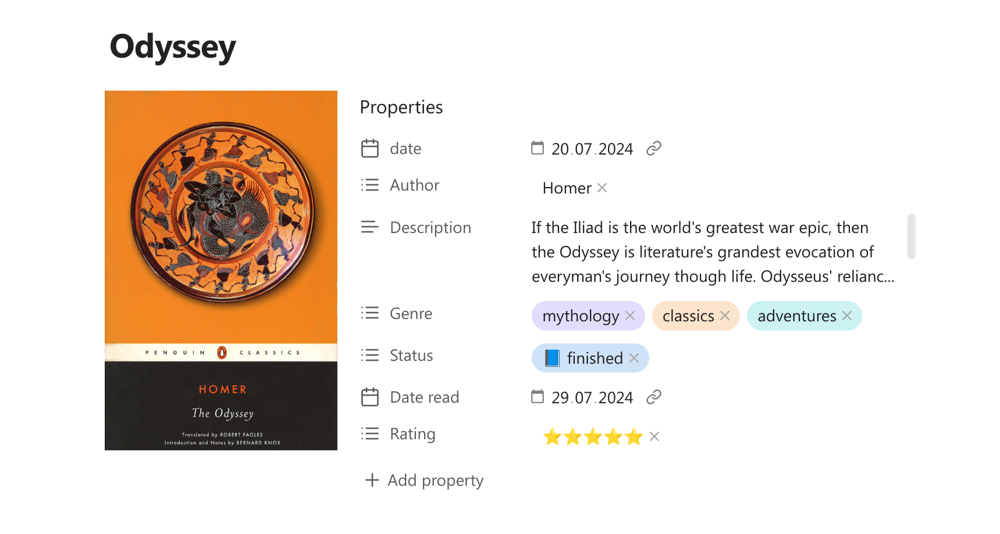
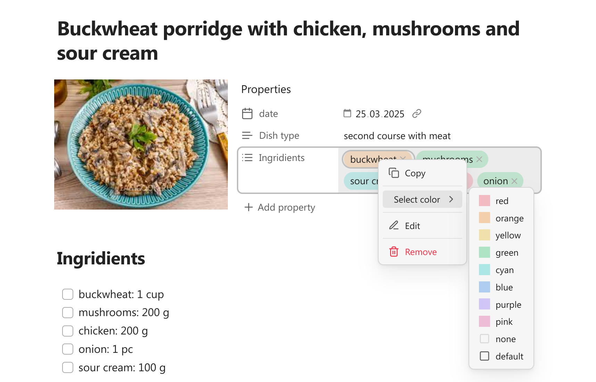

# Pretty properties

This plugin makes metadata block on the top of the file more visually appealing with images and colors.



## Features

### Cover image

Add image to the left of metadata block to save space in the note. Works great for book notes, people profiles etc. You can change the shape and size of the image using cssclasses.

To add image put image link into the "cover" property (must be of type "text"). You can use embeds,  wikilinks, markdown links or bare urls for external images. 

Add cssclasses to the note to change the shape of the image. Currently supported classes are "cover-vertical", "cover-horizontal", "cover-square" and "cover-circle". 


### Banner

You can add simple banners to your notes. To do so add the link to the "banner" property the same way as with cover. 


I intend to keep this very basic and simple and will not add any complex banner features. If you want to use some other banner plugin with more options, like Pixel Banner, turn off the banner functional in the settings. 

Banners might nor work well with every theme. If you banner margins are weird you will need to make some manual adjustments with css.

### Hide properties

If you have many properties in the note, you may want to hide some of them while keeping the others visible. This plugin makes it easy. Click on the property icon and select "Hide property" in menu. If you want to see it again, run command "Toggle reveal / hide all hidden properties". After that you will see the hidden properties and can mark them as not hidden.


### Colorful list properties

You can make you list properties stand out by assigning each item their own color. Right-click on the item pill to select color. You can also chose "none" to make the pill background transparent or reset it to default. Only basic theme colors are supported for now.



You can also add you own styling to the list properties. Each of them (even not colored ones) will get attribute "data-property-pill-value" containing actual value of item. You can use these attributes to write you own css for any individual item like this:

```
[data-property-pill-value="my-property-value"] {
    /* my styles */
}
```

## Installation

Untill this plugin is made availiable in the official plugins menu it can be insalled via BRAT:

1. Install the BRAT plugin from "Community plugins" page.
2. Go to the BRAT settings.
3. Click "Add Beta Plugin" button.
4. Paste the following URL in the text field: https://github.com/anareaty/pretty-properties.
5. Select the latest release.
6. Make sure that "Enable after installing the plugin" is checked.
7. Click "Add Plugin" button.

## Acknowledgments

This plugin uses a bit of code from the [Iconic plugin](https://github.com/gfxholo/iconic) to be able to add new items to menus. 